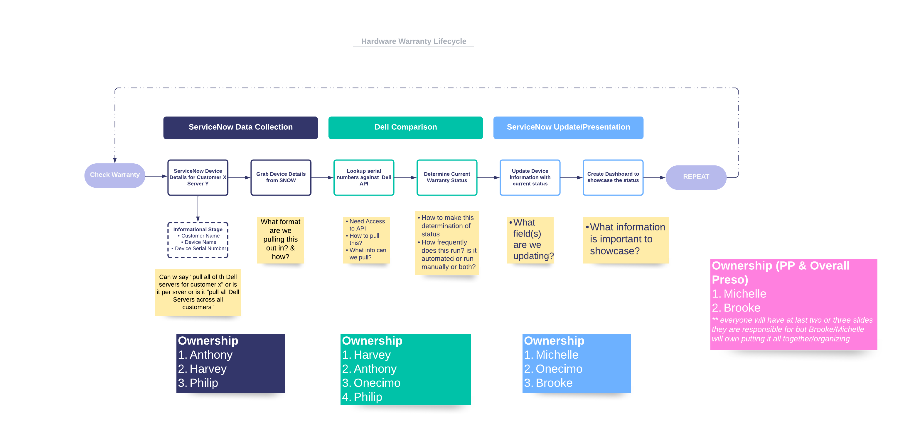
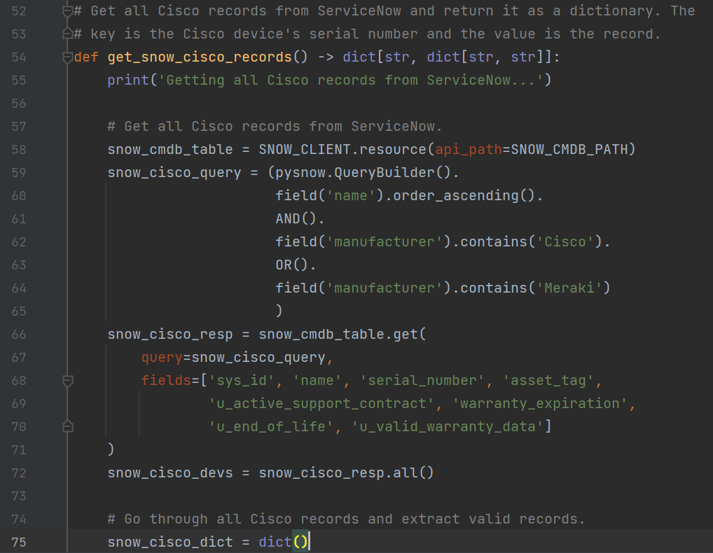
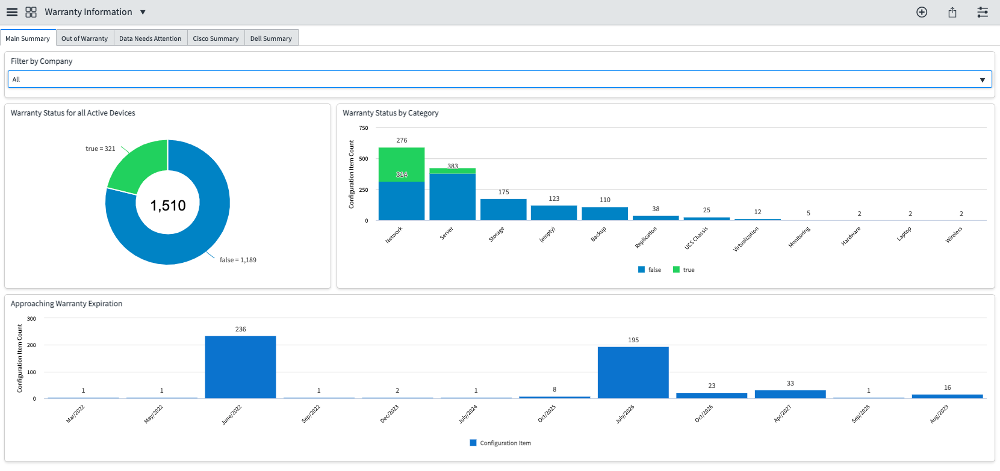

# Tech Vigilantes
## Digital Innovation Kickoff 2022
## Las Vegas, Nevada
### Wednesday, June 22, 2022
[Git Hub Repo](https://github.com/farinaanthony96/2022-DIKO-Dream-Team-4-Presentation)

---

_Keeping an eye on device lifecycles so you don't have to_

<!-- Keeping an eye on device lifecycles so you don't have to! Now please enjoy our infomercial 

CLICK LOGO to go to video

CLICK Back one done to get back to slide -->

---

# OUR MISSION
Tech Vigilantes focuses on one simple task: hardware lifecycle management. Our goal is to automate a way to keep all device warranty statuses accurate and up-to-date. This starts by grabbing key information from our ServiceNow CMDB for each configuration item and run this information against vendor support APIs to retrieve current support status and dates, End-of-Life dates, etc... Then we push this data back into ServiceNow to populate an easy-to-read dashboard that makes it easier to manage the hardware lifecycle.
#
#
#
_Let the **Tech Vigilantes** watch your lifecycles... it could save a life!_

---

# THE VIGILANTES

<!-- Add team photo when we get to Vegas -->

---

# Preparation Workflow

_** NOT Mermaid, but to be fair this was made before the mermaid requirement during our brainstorming sessions :)_ 

<!-- Creating this workflow allowed the team to see the bigger picture of the project with the different phases broken down. It also helped us sort out our ideas and questions for different iterations along with ownership of each phase/task. -->

---

# Project Planning
* Dashboard to summarize the whole project
* 4 Tasks Boards to organize tasks based on where they fit in the project
* Reports to summarize data for dashboard

<!-- Project Planning was key for this project since we had 2 months and each segment of the project could be overwhelming. We used the enablement project plan as a template to bring these 4 task boards together. Project Initiation, Presentation Development, Technical Deployment & Closeout. Save to say most of our delays came into play during the Technical Deployment phase. -->

---

# SCRIPT FLOWCHART

<!-- Goal is to update devices in SNow w/ warranty info

First, we get relevant records from SNow

Try to clean bad & missing data (S/N, corrupt data)

Send requests to API using S/N

Update relevant records into SNow 

Repeat process with other devices -->

---

# SCRIPT LOGIC

| Cisco API Field   | ServiceNow Field          | Field Type | 
|:------------------|:--------------------------|:-----------|
| is_covered        | u_active_support_contract | True/False |
| warranty_end_date | warranty_expiration       | Date       |
| LastDateOfSupport | u_end_of_life             | Date       |
|                   | u_valid_warranty_data     | True/False |

<!-- Go over API fields 

Connect API fields to SNow fields (with types)

Explain when valid warranty data field is true & false -->

---

# THE PULL

- Retrieve relevant device information from ServiceNow
- Device serial number cleanup
  - Filter out missing serial numbers
  - Attempt to correct corrupt data
- Added a check for the asset tag field to be used for the serial number if it was missing or invalid

<!-- Image is SNow pull for Cisco

Watch out for invalid data

Script skips missing S/N and attempts to clean S/N

Look at asset tag field if S/N is missing

Weird characters in some S/N -->

---

# THE OUTPUT 

- Script logs what is happening as it runs
- Summary of what it has found
  - Total valid / invalid records
  - Total duplicate records
- Begins to make API calls, filtering through each serial
- Notes when new data is being pushed to ServiceNow, missing data etc..

<!-- Image shows what the script is doing

Shows end of the 'get' output and beginning of updating SNow

We are making API calls as well -->

---

# THE PUSH

- The code that makes the magic work from the previous slide
  - Pushing to ServiceNow
  - Error output
- Need to update the relevant fields with API information

<!-- We have data from the API, now push to SNow

Use name & S/N to find relevant record

Print out if we are updating a record and any errors that happen 

Update the SNow fields and move onto the next record -->

---

# While We Are Pushing to ServiceNow...
- Once all information is gathered, we compare it to the ServiceNow records we collected from earlier
  - Only if we notice data needs to be updated, we will send an update to the ServiceNow instance
  - We don't want to send an update for ALL records, just the ones that NEED to be updated!
- Once the information from the script is in ServiceNow, that data can be interpreted from the ServiceNow dashboard

<!-- We need to compare what we have from the API to SNow

Only update SNow if we need to update information

This keeps the code efficient on subsequent runs

Once SNow is updated we can interpret the data in a SNow dashboard -->

---

# BIGGEST CHALLENGE

* ACCESS, ACCESS, ACCESS
    * All API access was difficult.
    * Cisco API took 10 days.
    * Dell Tech Direct, requested 4/19 provided 6/8
    * SuperMicro & HPE no success

<!-- To Dive quickly into our biggest hurdle, it was API access.  multiple steps into obtaining an approved account and the api keys. then getting the API call to work properly.
Started with creating accounts. We had to be registered with a company so that involved reaching out to our CC channel reps who also had to reach out to the vendor reps to approve access 
We first wanted to start with Dell, so we signed up for dell tech direct access but never got approved after several requests via the portal so we reached out our vendor reps who weren’t able to get our accounts assoicated just yet.
Then we tried supermicro and HPE but after diving into KB articles we found neither had support APIs. There was a workaround we were looking into using a script to parse the data on the support sites and then input serail info through the support portals that way but figured it would be more intuitive to find another Vendor that has support API access.  
So then we decided to go into cisco support api.    We came across similar issues with dell  Dell but thankfully we got in contact with Matt Harris who also worked with a cisco rep to get us the right access and keys.  Took a couple of back and forth to get it going but in the end we were able to get our first successful api call.
And just 2 weeks ago we finally got response to the Dell tech direct access
Now I pass it back to Anthony -->

---

# API CHALLENGE
## OAuth2.0

- Uses OAuth2.0 to make API calls
  - Need to get API token before we can make calls
- Need to make an app on Cisco API Console
  - Let the app access the Support / EOL APIs
  - This app will generate the information needed to get an OAuth2.0 token
- Gather the relevant information based off device serial numbers

<!-- Both Cisco & Dell use OAuth2.0

Step 1: Request for a token to OAuth server

Step 2: Get the token

Step 3: Make API request with token

Step 4: API validates request with OAuth server 

Step 5: API sends me a response 

Step 6: Repeats with other APIs based off manufacturer -->

---

# Other Challenges
* Filtering out Bad Data
* Needing additional fields in SNOW (several times)
    * Shout out to **Stefan** - thanks for putting up with us!
* Returning inconsistent data when spot checking devices
* Mixed up "warranty status" and "support status" - discovered and averted in the 11th hour
* Dell API only takes tags service tags not serial numbers - legacy EMC devices do not have service tags so we were only able to pull data for dell servers
* Time - Access took long

<!-- Could also talk about the minimal amount of features we have because of the time it took to get access

Add another comment... -->

---

# Dashboard Creation

1) Create all the proper fields for SNOW to handle Warranty, End of Life & Firmware details
2) Create Graphs & Tables to properly represent the data
3) Filter out devices with insufficient or improper data
4) Add Filter for Customer field

---
# Dashboard Overview

1) Main Summary
2) Out of Warranty
3) Data Needs Attention
4) Cisco Details
5) Dell Details

[Dashboard Link](https://expertservicestest.service-now.com/$pa_dashboard.do?sysparm_dashboard=c0667914870415501ed1cb77cebb35ea&sysparm_tab=9766fd14870415501ed1cb77cebb35e7&sysparm_cancelable=true&sysparm_editable=false&sysparm_active_panel=false)

---

# THE FUTURE

* Go into further depth on what we pull from the API
    * What Kind of Support do they have?
    * Contract Numbers
* Improve Dell API compatibility - limited to only Dell legacy devices and not EMC
* Automate script to run on a regular cadence
* Create a catalog item in SNOW that allows the customer to initiate an ADHOC update 
* Expand compatibility to other vendors and OEMS 
* Incorporate Firmware Version checks through other APIs 

<!-- We should talk about how the project could help other businesses if they use this product -->

---

